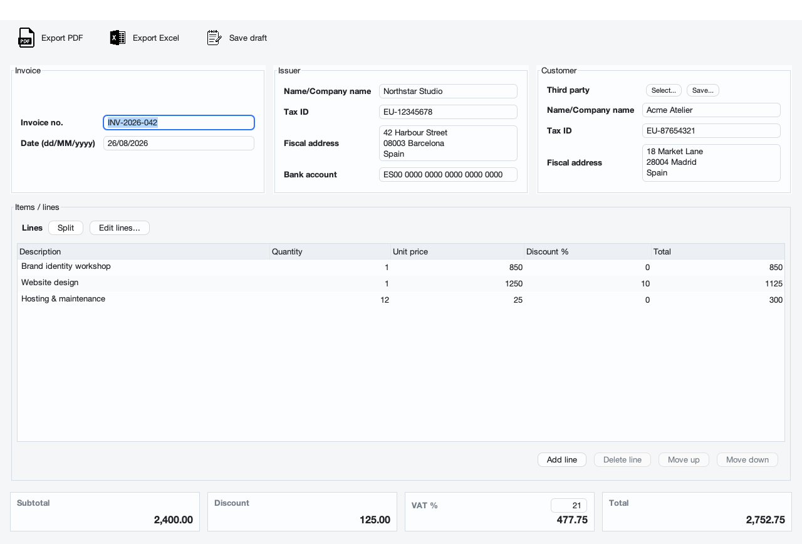
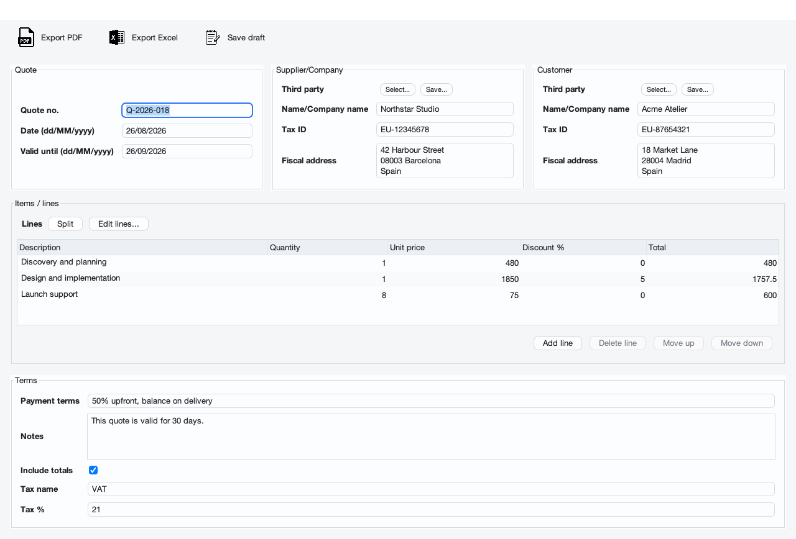

<p align="center">
  
</p>

<p align="center">
  <strong>Invoices and quotes, without the fuss.</strong><br>
  A calm, private desktop app for small businesses and independent professionals.
</p>

<p align="center">
  <a href="https://github.com/eduardtomas1/invocely/releases/latest"><strong>Download Invoicely</strong></a>
  &nbsp;&middot;&nbsp;
  <a href="#what-you-can-do">Features</a>
  &nbsp;&middot;&nbsp;
  <a href="#your-data-stays-yours">Privacy</a>
</p>

<p align="center">
  
  
  
</p>



## Paperwork should feel lighter

Invoicely keeps the everyday job simple: add the people involved, describe the work, check the totals, and export a polished document. There is no account to create, no subscription, and no cloud dashboard to learn.

It works especially well for freelancers, studios, tradespeople, and small businesses that want straightforward invoices and quotes without adopting a full accounting suite.

## What you can do

- Create **invoices and quotes** from one focused desktop app.
- Calculate quantities, prices, line discounts, tax, and totals automatically.
- Export finished documents as **PDF, Excel, or CSV**.
- Save drafts as XML and reopen them whenever you need.
- Keep reusable company details and a private address book of customers and suppliers.
- Add your own logo to every exported document.
- Work in **English, Spanish, or Catalan**.

## One app, two simple workflows

### Send a clear invoice

Add your business and customer details, enter each line, and let Invoicely calculate the rest.

### Turn an idea into a quote

Set the validity period, payment terms, notes, and optional totals before sharing the proposal.



## Your data stays yours

Invoicely works offline. It has no user accounts, analytics, or remote database. Your drafts and exported documents go only to locations you choose, while saved defaults and third-party details stay on your computer.

## Download for macOS

1. Open the [latest release](https://github.com/eduardtomas1/invocely/releases/latest).
2. Download the **Apple silicon** DMG for M-series Macs.
3. Open it and drag Invoicely to **Applications**.
4. On the first launch, macOS may ask you to right-click Invoicely and choose **Open** because this community build is not notarized.

The release also includes a cross-platform JAR for Windows, Linux, and Intel Macs with Java 11 or newer installed.

> Invoicely helps create business documents. It does not replace professional accounting or tax advice, and requirements vary by country.

<details>
<summary><strong>Build from source</strong></summary>

You will need Java 11 or newer and Maven.

```bash
mvn -q -DskipTests package
java -jar target/invocely-1.0.0.jar
```

To create a self-contained macOS installer:

```bash
./scripts/package-macos.sh
```

Packaging requires a JDK that includes `jpackage` (JDK 17 or newer is recommended).

</details>

## License

Invoicely is free and open source under the [Apache License 2.0](LICENSE).
